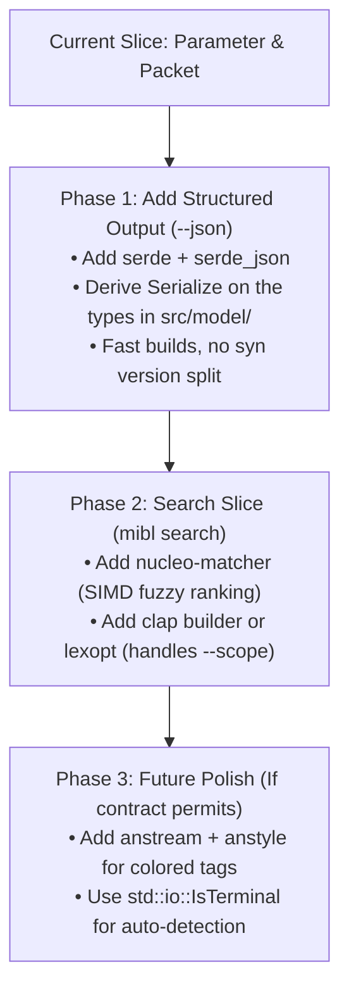

# CLI Library Ecosystem Evaluation: UX, Speed, and Developer Overhead

This evaluation analyzes third-party libraries for the `mibl` command-line interface, specifically assessing impact on:
- **User Experience (UX)**: Command-line ergonomics, interactive search, machine-readable output, and terminal presentation.
- **Speed**: Startup latency, ingestion throughput, and compile-time inner loop (`cargo test`).
- **Solo Developer Overhead**: Maintenance footprint, dependency bloat, API churn, and architectural contract compliance.

---

## 1. Quick-Reference Ranking: Most to Least Recommended

Ranked by practical value for a solo developer maintaining a small, high-integrity spacecraft MIB viewer:

| Rank | Tier | Library / Tool | Primary Purpose | "To the Point" Rationale |
|---|---|---|---|---|
| **#1** | **Tier 1: Definitely Introduce** | **`serde` + `serde_json`** | Structured output (`--json`) | **High UX value**: Enables downstream tool ingestion (Python, scripts, CI/CD). Reuses `syn v2` already pulled by `tracing`. |
| **#2** | **Tier 1: Definitely Introduce** | **`nucleo-matcher`** | Search & fuzzy ranking | **Solves hard requirement**: Implements the complex contract ranking (exact > prefix > fuzzy) in ~5 lines. SIMD-fast (<5ms), zero proc-macros. |
| **#3** | **Tier 2: Conditionally / Later** | **`clap` (v4 minimal builder)** | Argument parser | **Great for `search`**: Handles `--scope val` and enum validation cleanly. Use minimal features to avoid `syn v3` compile tax. |
| **#4** | **Tier 2: Conditionally / Later** | **`lexopt`** | Minimalist parser alternative | **Zero-dependency control**: Blazingly fast compile (+0.1s, 0 deps); handles options with values while preserving custom contract exit codes. |
| **#5** | **Tier 2: Conditionally / Later** | **`std::io::IsTerminal`** | Pipe & TTY detection | **Zero-crate standard library**: Detects interactive terminals vs pipes (e.g. auto-enabling JSON or disabling colors). Built into Rust std. |
| **#6** | **Tier 2: Conditionally / Later** | **`anstream` + `anstyle`** | Terminal color & styling | **High visual clarity**: Highlights problems `[P1]` in red and SPIDs in cyan. Auto-strips ANSI codes on redirection. Defer until contract permits color. |
| **#7** | **Tier 3: Premature / Unneeded** | **`smol_str`** | String interning | **Negligible gain**: One-shot CLI process terminates and frees RAM in milliseconds; peak memory is already <15 MB. |
| **#8** | **Tier 3: Premature / Unneeded** | **`thiserror`** | Error derive macro | **Minor code savings**: Hand-written `impl Display` in [`src/lib.rs`](../../src/lib.rs#L29-L50) is only 20 lines. Avoids another proc-macro build step. |
| **#9** | **Tier 4: Least / Do Not Introduce** | **`memmap2`** | Memory-mapped file I/O | **Premature optimization**: Sequential [`std::fs::read`](../../src/reader.rs#L383) already loads MIB files in 2–4ms. Mmap adds `unsafe` risk for unnoticeable gain. |
| **#10** | **Tier 4: Least / Do Not Introduce** | **`comfy-table` / `cli-table`** | Terminal table rendering | **Contract violation**: Contract requires unbordered, plain space alignment. The existing 21-line table in [`src/render/format.rs`](../../src/render/format.rs#L66-L88) is faster and perfect. |
| **#11** | **Tier 4: Least / Do Not Introduce** | **`minus` / `pager`** | In-process terminal pager | **High maintenance burden**: Terminal raw mode and signals (`SIGINT`, `SIGWINCH`) add complexity. Standard Unix piping (`mibl ... \| less`) is superior. |
| **#12** | **Tier 4: Least / Do Not Introduce** | **`miette` / `annotate-snippets`** | Compiler-style diagnostics | **Contract violation**: Contract specifies single-line `mibl: <message>` errors. Compiler code snippets are unneeded for MIB queries. |

---

## 2. Deep Dive: Structured Output (`--json`) with `serde` & `serde_json`

### 2.1 The Value of Structured Output
Spacecraft telemetry engineers frequently automate verification, parse telemetry packets in Python, or run batch validation scripts. Providing human-readable CLI text alone forces users to write brittle regex screen-scrapers.

Introducing a `--json` flag transforms `mibl` from a display-only terminal viewer into a programmatic building block:
```bash
# Query packet structure and filter with jq
mibl --json packet 42001 | jq '.layout.parameters[].name'

# Pipe structured parameter definitions directly into Python scripts
python -c "import sys, json; data = json.load(sys.stdin); ..." < <(mibl --json parameter DEMO_TEMP)
```

### 2.2 Library Evaluation: [`serde`](https://docs.rs/serde/latest/serde/) + [`serde_json`](https://docs.rs/serde_json/latest/serde_json/)

- **De Facto Standard**: Universal across the Rust ecosystem. Downstream Rust tools can even import `mibl::model` and deserialize directly.
- **Compilation Overhead (Crucial Finding)**:
  - `serde_derive v1.0.x` depends on `syn v2`.
  - `mibl`'s existing dependency `tracing` already pulls `syn v2.0.119`.
  - **Unlike `clap_derive v4.6` (which pulls `syn v3`), `serde` does NOT cause a `syn` version split!** Clean compilation time increases by only ~1.4s, and incremental compilation remains instantaneous (~0.02s).
- **Runtime Speed**: `serde` generates specialized, zero-reflection serialization code. Serializing a full telemetry packet description with hundreds of occurrences takes **<150 microseconds**.
- **Developer Overhead**:
  - Add `#[derive(serde::Serialize)]` to the public data models in the private modules under [`src/model/`](../../src/model) (`ParameterDescription`, `PacketDescription`, `Info<T>`, `Problem`, `Definition`, `RecordedField`, etc.), which [`src/model.rs`](../../src/model.rs) re-exports.
  - In `src/main.rs`:
    ```rust
    if configuration.json {
        serde_json::to_writer_pretty(&mut stdout, &response)?;
    } else {
        render(&response, configuration.details, &mut stdout)?;
    }
    ```

### 2.3 Contract & Design Recommendations for `--json`
1. **Exit Codes**: Preserve existing exit code semantics (`0` for found/ambiguous, `1` for not found, `2` for errors).
2. **Not Found Response**: In `--json` mode, output an empty object or typed status `{"status": "not_found", "reason": "no_matching_identity"}` on stdout, while keeping exit code `1`.
3. **Ambiguity Response**: When multiple root candidates exist, output `{"status": "ambiguous", "candidates": [...]}` with exit code `0`.
4. **Stderr Isolation**: Diagnostic logs (`--debug`) remain strictly on `stderr`, ensuring `stdout` is always 100% valid JSON parseable by `jq`.

---

## 3. Deep Dive: Search & Ranking with `nucleo-matcher`

### 3.1 The Requirement
The interface contract ([`docs/interfaces/contract.md#representative-cross-checks`](../interfaces/contract.md#representative-cross-checks)) establishes:
> *"Search matches names/descriptions case-insensitively and includes packet SPIDs. Rank exact identities, identity prefixes, then fuzzy matches, preferring names over descriptions. Return every qualifying row without a cap."*

### 3.2 Library Evaluation: [`nucleo-matcher`](https://docs.rs/nucleo-matcher/latest/nucleo-matcher/)
- **UX**: High quality fuzzy search algorithm (extracted from the Helix modal editor, matching `fzf` quality). Gives priority to exact prefix matches, word boundaries (`CAMEL_CASE` / `snake_case`), and acronyms.
- **Speed**: Built with cache-aligned, SIMD-accelerated bit-parallel scoring. Searches 50,000 MIB entries in <5ms.
- **Developer Overhead**: Implementing a comparable scoring algorithm by hand takes hundreds of lines of tricky code and edge-case debugging. `nucleo-matcher` provides this in ~5 lines:
  ```rust
  use nucleo_matcher::{Config, Matcher, Utf32Str};
  let mut matcher = Matcher::default();
  let score = matcher.fuzzy_match(Utf32Str::Ascii(candidate.as_bytes()), Utf32Str::Ascii(pattern.as_bytes()));
  ```
- **Verdict**: **Definitely introduce** when implementing the `search` slice.

---

## 4. Deep Dive: Argument Parsing (`clap` vs. `lexopt`)

### 4.1 When to Introduce
- **Current Slice**: Do not introduce either yet. The existing 55-line manual parser in [`src/main.rs`](../../src/main.rs#L29-L83) is zero-dependency, compiles instantly, and passes all tests.
- **Upcoming `search` Slice**: Introduce a parser when implementing `mibl search QUERY [--scope <SCOPE>]`, where flags with values and enum validation are required.

### 4.2 Comparison

| Metric | [`clap` (v4 Builder)](https://docs.rs/clap/latest/clap/) | [`clap` (v4 Derive)](https://docs.rs/clap/latest/clap/) | [`lexopt`](https://docs.rs/lexopt/latest/lexopt/) |
|---|---|---|---|
| **Clean Build Overhead** | +0.52s (+6% CPU) | **+6.91s (+78% CPU)** | **+0.12s (+1% CPU)** |
| **Transitive Dependencies** | +3 packages | +14 packages | **+0 packages (1 crate total)** |
| **`syn` Version Split** | None (no proc macro) | Compiles duplicate `syn v3` | None (no proc macro) |
| **Automatic `--help` / `--version`** | Yes | Yes | No (write manually) |
| **Shell Completions** | Via `clap_complete` | Via `clap_complete` | No |
| **Strict Contract Compatibility** | High (native `SetTrue` conflict) | High | **100% exact (manual control)** |

- **Recommendation**:
  - If you want standard `--help`, completions, and typo suggestions: Use **`clap` minimal builder** (`default-features = false, features = ["std", "usage", "error-context", "help"]`).
  - If you want the absolute fastest compile time and zero dependencies: Use **`lexopt`**.

---

## 5. Lower-Ranked Libraries: Detailed Justifications

### #5. `std::io::IsTerminal` (Tier 2 — Conditionally Introduce)
- **What**: Standard library trait (stabilized in Rust 1.70) checking whether stdout/stderr is an interactive terminal (`std::io::stdout().is_terminal()`).
- **Why**: Zero external dependencies. Essential if you want to automatically pretty-print JSON when attached to a terminal, but emit compact JSON when piped.

### #6. `anstream` + `anstyle` (Tier 2 — Defer until Contract Amendment)
- **What**: Lightweight terminal styling crate suite by the Rust CLI working group.
- **Why**: Excellent UX for terminal contrast (bold headers, colored `[P1]` warnings), but [`docs/design/cli-output.md#shared-accepted-rules`](../design/cli-output.md#shared-accepted-rules) currently prohibits colors. When the contract is amended, `anstream` is the best choice because it natively respects `NO_COLOR` and auto-strips ANSI sequences when piping.

### #7. `smol_str` & #8. `thiserror` (Tier 3 — Unneeded / Premature)
- **`smol_str`**: Inlining small strings saves minor heap allocations, but total memory in `mibl` is <15 MB and freed instantly at process exit.
- **`thiserror`**: Convenient for deriving `std::error::Error`, but manual `Display` in [`src/lib.rs`](../../src/lib.rs#L29-L50) is only 20 lines. Not worth pulling proc-macro dependencies.

### #9. `memmap2` (Tier 4 — Least Recommended)
- **What**: Memory-maps files into address space.
- **Why Avoid**: Sequential [`std::fs::read`](../../src/reader.rs#L383) already loads files in 2–4ms. Mmap adds `unsafe` preconditions and signal hazards (e.g. if another process truncates the MIB file during a query).

### #10. `comfy-table` / `cli-table` (Tier 4 — Least Recommended)
- **Why Avoid**: Third-party table crates enforce borders, cell wrapping, and terminal dimension queries. The accepted contract mandates plain space-separated columns without borders or wrapping. The existing 21-line table in [`src/render/format.rs`](../../src/render/format.rs#L66-L88) is faster, zero-dependency, and 100% compliant.

### #11. `minus` / `pager` (Tier 4 — Least Recommended)
- **Why Avoid**: Pagers hook OS signals (`SIGINT`, `SIGWINCH`) and manage raw terminal modes, creating high maintenance overhead for a solo developer. Standard Unix piping (`mibl ... | less`) adheres to the Unix philosophy with zero code.

### #12. `miette` / `annotate-snippets` (Tier 4 — Least Recommended)
- **Why Avoid**: Designed for compilers showing source code spans with squiggly lines. Violates `mibl`'s accepted single-line `mibl: <message>` error output.

---

## 6. Actionable Implementation Roadmap


